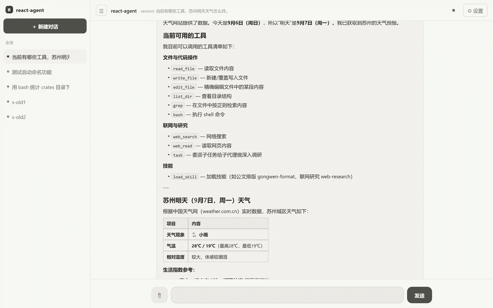

# react-agent

基于 [agent-kernel](https://github.com/zh2673-git/agent-kernel)（v0.1.1，git 依赖）构建的下游 agent 项目：**Rust InProcess 编排 + Python/TS 跨语言插件（gRPC Process 域）** 的 ReAct 式 agent。

```
宿主(装配内核+前端) ──dispatch──> agent-loop(Rust, InProcess)
                                      │ call_plugin（按 Envelope.target 路由，跨域）
        ┌──────────────────┬──────────┼──────────────────┐
        ▼                  ▼          ▼                  ▼
  llm-adapter(Python)   tools(Python) assets(Python)   memory(TypeScript)
  provider pack 注册表   生产级 8 工具  skills/prompts   会话消息+事件日志
  (openai/anthropic/    +越界拦截     注册表(渐进披露)  (JSON/JSONL)
   ollama/mock)         +免费搜索链
```

- 内核只做：插件装载隔离、执行编排、契约/权限校验；一切能力皆为插件
- ReAct 循环：感知(读记忆)→规划(LLM+工具清单)→行动(执行工具/保留名路由)→观察(写回记忆)→收敛；全程发射事件（trace）+ 逐轮进度回显
- 三家 LLM 全覆盖：OpenAI 兼容（可换 base_url 适配 DeepSeek 等）、Anthropic、Ollama；另带 **mock** provider 供离线测试
- 生产级工具 8 件：read_file / write_file / edit_file / list_dir / grep / bash / web_search / web_read（全部免费默认无 key）
- 双前端：REPL（默认）/ Web 网关（HTTP+SSE，Cursor 暖色系事件流式会话：左侧会话栏 + 自动命名 + 持久化、「思考与工具」过程框（思考链 + 工具卡状态点，可折叠回看）、🔗 来源 chip 溯源抽屉、产物文件卡片（预览/下载）、📎 附件上传、消息回滚/重新生成、subagent 实时框、富 markdown（表格/代码块复制），刷新恢复 = 日志重放）
- **Web 配置中心**（08）：右上角 ⚙ 侧边抽屉四标签——LLM（provider/model/站点预设/base_url/api_key，ollama 另显模型原生窗口，热生效 + 落盘 config.json）、工具（白名单勾选）、技能（SKILL.md 在线编辑 + R9 配套工具就地启停）、Agent（max_rounds/系统提示词/上下文窗口等热通道）；配置源文件一键「在编辑器中打开」
- **自扩展**（08）：L1 技能自扩展——skills 根在 WORKSPACE_ROOT 内时系统提示词授权模型用 write_file 自建技能（文件即注册表，下轮对话自动可见）；L2 工具自扩展——`tools.reload` 动态装载新工具模块（装载≠启用，白名单两步分离）；R9 技能自造闭环——`skill_install` 编排 + 语言无关配套工具（tools.json 声明 + 任意语言执行体），前端内联卡一键启用（装载≠启用≠可见，见「配置中心与自扩展」）。**已实证**：[`gongwen-format`](plugins/assets/skills/gongwen-format/SKILL.md)（公文格式写作）即 agent 在对话中自建的技能——SKILL.md 与配套工具（tools.json + Python 执行体）均由模型一次生成，内联卡启用后跨会话可用，非人工预置
- subagent：保留工具 `task` 委派子任务（新 session 复用全链路，深度防嵌套）；前端「思考与工具」过程框内嵌套「子代理」实时框——子代理的思考流与工具卡实时透传呈现（trace 事件镜像 + 子旁路流式），委派不再"图标一闪就卡住"

## 界面一览



> 实机动图轮播（`REACT_FRONTEND=web` 默认形态）：会话流（左侧会话栏自动命名 + 持久化，刷新即恢复）→
> 「思考与工具」过程框展开（💭 思考链 + 工具卡状态点，可折叠回看）→ 🔗 来源 chip 溯源抽屉 →
> ⚙ 设置面板：LLM（模型/站点/key）· 技能（自建技能 gongwen-format 及配套工具启停区）· Agent（max_rounds/上下文窗口热通道）。
> 图中会话即 agent 实际运行记录——工具清单查询 + 联网查天气 + 自动落盘会话命名。

## 目录

```
crates/agent-loop        ReAct 编排插件（InProcess，仅依赖 agent-kernel-sdk）
crates/host              宿主二进制：装配、spawn、探测、双前端（frontend repl + web/ 网关）、sandbox-run 助手；web-dist/ 为 web 前端三文件 index.html+style.css+app.js（运行时 serve，非内嵌）
plugins/llm_adapter      LLM 适配器（Python guest，providers/ 按 vendor 分 pack）
plugins/tools            工具注册与执行（Python guest，纯 stdlib，files/bash/web/grep 分文件）
plugins/assets           skills/prompts 注册表（Python guest，开放标准 SKILL.md）
plugins/memory           会话记忆 + 事件日志（TS guest，strip-types）
docs/                    方案与设计文档（01 总纲 / 02 架构 / 03 模块契约 / 04-07 分模块四层设计）
```

## 环境准备（一次）

> Windows 下用 [start.cmd](start.cmd) 一键启动可跳过本节——脚本会自动检测并安装缺失依赖。

```bash
pip install grpcio httpx                                  # python guest 需要
cd ../agent-kernel/bindings/typescript && npm install     # TS guest 从内核仓解析 @grpc 依赖
```

- 前置：Rust、Python 3、Node ≥ 22.6（`--experimental-strip-types`）
- 内核 checkout 默认取本目录旁的 `../agent-kernel`，可用 `AGENT_KERNEL_REPO` 覆盖
- 本地开发内核：取消 `Cargo.toml` 里 `[patch]` 段注释

## 运行

> ⚠️ 默认 `cargo run -p react-agent-host`（不带参数）进入 **REPL 终端交互**，**不会开网页**。
> 要开 Web 页面，必须显式启用 web 前端（见下 `REACT_FRONTEND=web`），或直接双击 `start.cmd`。

```bash
# ── Web 前端（推荐，浏览器开 http://127.0.0.1:8710）──
# Windows 一键（自动补依赖 + 自动开浏览器）：
start.cmd
# PowerShell（bash 的 VAR=val 前缀在 pwsh 不生效，改用 $env:）：
$env:REACT_FRONTEND="web"; cargo run -p react-agent-host
# bash / Linux / macOS：
REACT_FRONTEND=web cargo run -p react-agent-host
# 前端为 web-dist/index.html（运行时读取），改样式刷新即生效（Ctrl+Shift+R 防缓存）

# ── REPL 终端（默认，无网页）──
cargo run -p react-agent-host                          # 进 REPL
cargo run -p react-agent-host -- "用 bash 算一下 128*64"   # 单轮（离线 mock）后退出

# Ollama（本机，推荐支持工具调用的模型如 qwen2.5 / llama3.1+）
LLM_PROVIDER=ollama LLM_MODEL=qwen2.5:7b cargo run -p react-agent-host -- "..."

# OpenAI 兼容（OpenAI/DeepSeek 等）
LLM_PROVIDER=openai LLM_BASE_URL=https://api.deepseek.com/v1 \
OPENAI_API_KEY=sk-xxx LLM_MODEL=deepseek-chat cargo run -p react-agent-host -- "..."

# Anthropic
LLM_PROVIDER=anthropic ANTHROPIC_API_KEY=sk-ant-xxx cargo run -p react-agent-host -- "..."
```

## 前端开发（无构建）

Web 前端是单文件 `crates/host/web-dist/index.html`（内联 CSS/JS，无框架、无构建步骤），由后端 `GET /` 运行时读取 serve。

- **默认（推荐）**：`cargo run -p react-agent-host`（或 `start.cmd`）起 8710，浏览器开 `http://127.0.0.1:8710` 即同时拿到前端与 `/api`。改 `web-dist/index.html` 后**刷新浏览器即生效**（无需重编 host；若页面不更新按 `Ctrl+Shift+R` 硬刷规避缓存）。
- **前后端分离（独立端口，HMR）**：后端 `cargo run -p react-agent-host`（8710 作 API 源），前端用 `vite` 起在 `crates/host/web-dist/`（已内置 `vite.config.js`，`/api` 自动反代回 8710）：
  ```bash
  cd crates/host/web-dist && npm install && npm run dev   # 默认 http://localhost:5173
  ```
  浏览器开 5173 即前端（热重载），`/api/*` 经代理转发到 8710，无需跨域配置。仅改样式也可直接编辑 `web-dist/` 文件后刷新，不必起 vite。
  > 没有构建/HMR 需求时不必分离：改完刷新即生效，「一体启动」已是最简工作流。

## 环境变量

| 变量 | 默认 | 说明 |
|---|---|---|
| `LLM_PROVIDER` | `mock` | mock / openai / anthropic / ollama（也可按请求覆盖） |
| `LLM_MODEL` | 按 provider | 模型名 |
| `LLM_BASE_URL` | `https://api.openai.com/v1` | openai 兼容端点 |
| `OLLAMA_HOST` | `localhost:11434` | ollama 地址（Web 设置面板「ollama 地址」栏可改，默认即此值；ollama 免 key，api_key 无效） |
| `OLLAMA_ENDPOINT` | `native` | ollama 传输通道：native（原生 `/api/chat`，per-request `options.num_ctx` + NDJSON 流式）/ v1（回退 OpenAI 兼容层 `/v1`） |
| `OPENAI_API_KEY` / `ANTHROPIC_API_KEY` | — | 密钥（经子进程 env 传递，不落 manifest） |
| `ANTHROPIC_BASE_URL` | `https://api.anthropic.com` | Anthropic 端点 |
| `MOCK_SCRIPT` | — | mock provider 脚本（JSON 数组，逐次弹出） |
| `MAX_ROUNDS` | `8` | ReAct 最大轮数 |
| `AGENT_OUTPUT_DIR` | `outputs` | 产物输出目录（工作区内相对路径）：系统提示词注入产物统一写入约定，前端文件卡片经 `GET /files/{path}` 预览/下载 |
| `LLM_EXTRA_BODY` | — | openai 兼容族请求体逃生舱（JSON 整体合并，如 `{"enable_thinking":true}`）；非法 JSON 打警告忽略 |
| `LLM_DEBUG` | — | 置 `1` 时把 openai 兼容族最终请求体落盘 `.stream/last-request.json`（诊断请求差异） |
| `SESSION_ID` | `default` | REPL/单轮会话 id |
| `AGENT_KERNEL_REPO` | `../agent-kernel` | 内核 checkout（PYTHONPATH/TS shim 解析） |
| `PLUGINS_DIR` | `<workspace>/plugins` | guest 脚本目录 |
| `MEMORY_DATA_DIR` | `plugins/memory/data` | memory 会话与事件日志持久化目录 |
| `WORKSPACE_ROOT` | 进程 cwd | 文件工具越界拦截根（realpath 前缀校验） |
| `TOOLS_ENABLED` | 全开 | 逗号分隔白名单，如 `read_file,write_file,bash`（R9：技能工具名持久化后重启 → 延迟启用，install 时自动生效，不再启动失败） |
| `SKILL_TOOL_TIMEOUT_SECS` | `60` | R9 技能工具子进程执行超时（超时杀进程，字段级错误） |
| `SEARCH_REGION` | `cn` | cn（Bing→搜狗→百度零 key 直连）/ global（ddgs→DDG→Bing） |
| `SEARCH_BACKEND` | 自动 | 强制指定引擎：bing / sogou / baidu / ddgs / duckduckgo / bocha / baidu_ai / tavily |
| `BOCHA_API_KEY` / `BAIDU_API_KEY` / `TAVILY_API_KEY` | — | 可选升级搜索后端 |
| `SKILLS_DIR` / `PROMPTS_DIR` | `<workspace>/plugins/assets/{skills,prompts}` | 资产目录 |
| `AGENT_SYSTEM_PROMPT` / `SYSTEM.md` / `PROMPT` | 内置缺省 | 提示词覆盖优先级：env > SYSTEM.md > 具名模板 > 内置 |
| `HISTORY_LIMIT` | 不限 | 每轮回传历史条数上限 |
| `COMPACT_TRIGGER` / `COMPACT_KEEP` | `40` / `10` | 上下文压缩触发阈值（0=禁用）/ 保留最近条数 |
| `LLM_CONTEXT_TOKENS` | `0`（禁用） | 模型上下文窗口（token）：压缩 token 闸 + 发送前逐级收紧（超限收敛为 CONTEXT_OVERFLOW）；并随 `llm.chat` 透传 `num_ctx`（ollama native 映射 `options.num_ctx`，两侧窗口对齐），见 agent-loop README「上下文体积管理」。**L7：仅本地窗口型 provider 生效**（`LOCAL_WINDOW_PROVIDERS` 名单：ollama，新本地后端加名扩展；云端 API 窗口由服务端管理——本闸禁用、`num_ctx` 不下发，为本地调小的窗口值不影响云端历史压缩） |
| `BASH_SANDBOX` | `on` | on=sandbox-run 受限令牌沙箱（探测失败 fail-closed 移除 bash）；off=显式豁免直跑 |
| `REACT_FRONTEND` | `repl` | 前端选择：repl / web |
| `WEB_ADDR` | `127.0.0.1:8710` | web 网关监听地址 |
| `CONFIG_FILE` | `<workspace>/config.json` | 配置中心持久化文件（启动时应用为 env，Web 保存后落盘） |
| `RUST_LOG` | `warn,react_agent_host=info` | 日志 |

## 测试

```bash
cargo test -p react-agent-agent-loop   # 纯 Rust mock 测试（无需 python/node）
cargo test --workspace                 # 全量（含跨语言 e2e，缺解释器自动 skip）
```

e2e：tools(7 工具往返)、memory(append/get/clear/summarize)、llm(mock 脚本)、**全链路 ReAct**、上下文压缩、web 网关（chat+SSE 重放 + **配置中心与技能 CRUD**）、subagent（委派+嵌套拒绝+**事件镜像透传**）。

> 注意：若测试失败提前退出，guest 子进程可能残留（占用内存无害）；可用 `Get-Process python,node` 检查清理。测试内已将 guest stderr 指向 null，cargo 不会再被泄漏进程扣住。

## Wire 契约（Contracts）

跨插件 payload 均为 JSON；业务错误走 payload 内 `{"ok":false,"error":{...}}`，`KernelError` 仅承载传输/生命周期失败。路由按 `Envelope.target`；op 分派在 payload 的 `"op"` 字段。

**agent-loop**（`agent.chat`）
- req `{"op":"chat","session_id":str,"user_text":str,"attachments"?:[Attachment]}`（attachments：host 已校验，图片走多模态映射、文本文件内嵌 content，见「用户附件」）
- resp `{"ok":true,"answer":str,"rounds":int,"steps":[{"round":int,"tool":str,"ms":int}],"session_id":str}` | `{"ok":false,"error":{...}}`
- 保留工具名（不进 tools.list，由 agent-loop 路由）：`load_skill`→assets `skills.load`（成功发 `skill_loaded` trace 事件，会话技能集重放推导依据）；`skill_install`→R9 技能安装编排（assets skills.load 取声明 → tools.install fail-closed 装载 → trace `skill_installed`）；`task`→子代理（新 session 复用 agent.chat，深度防嵌套）
- **产物登记**：write_file/edit_file 成功 → trace `{"type":"artifact","path","tool","bytes"?}` 事件；bash/最终答案文本经扩展名启发式扫描兜底（双闸：二进制成品任意位置放行；md/html/txt 等文本类仅产物目录 `AGENT_OUTPUT_DIR` 内放行——避免 rg/ls 输出把整仓文档刷成卡）；前端渲染可点击文件卡片（流式期间在过程框内，回合收敛后置底展示在最终答案下方），`GET /files/{path}` 服务内容（realpath ⊆ WORKSPACE_ROOT，`?download=1` 下载）。**提及过滤（W9.3）**：最终答案收敛时只保留答案文本点名的文件（路径或文件名匹配，大小写/路径分隔符归一；一条都没点名则不过滤防误杀）——中间草稿等未提及产物自动移除
- **来源登记（信息溯源）**：web_search 成功 → trace `{"type":"sources","tool","items":[{"title","url"}]}`（web_read 单 URL 同款）；URL http/https 白名单 + 去重 + 上限 10 条；前端回合内累计去重折叠为一张「🔗 来源 (N)」chip 卡，点击右侧滑出抽屉逐条查看标题与链接（W9.3），与产物卡一并置底，方便回答依据溯源

**llm-adapter**（`llm.chat`）
- req `{"op":"chat","provider"?:"openai"|"anthropic"|"ollama"|"mock","messages":[Msg],"tools"?:[ToolSpec],"stream_path"?,"sid"?,"num_ctx"?:int}`（`num_ctx` 源自 `LLM_CONTEXT_TOKENS`，0/缺省不下发；仅 ollama native 映射 `options.num_ctx`）
- Msg = `{"role":"system"|"user"|"assistant"|"tool","content":str|null,"tool_calls"?:[{"id","name","arguments":object}],"tool_call_id"?:str,"attachments"?:[{"name","mime","data_b64"}]}`（attachments 仅图片，provider 按协议映射）
- ToolSpec = `{"name","description","parameters":json-schema}`
- resp `{"ok":true,"content":str|null,"tool_calls":[{"id","name","arguments":object}],"model":str,"finish_reason":"stop"|"tool_calls"}`
- 扩展 `{"op":"configure","provider"?,"model"?,"base_url"?,"api_key"?}` → `{"ok":true,"applied":{...}}`（08 运行时热配置：更新本进程 env；api_key 只回 api_key_set）
- 扩展 `{"op":"abort","session_id":str}` → `{"ok":true,"session_id","note"}`（R1 取消：置位进程级取消注册表，流式循环逐帧检查命中即关流返回 K499；时间戳语义防误伤陈旧信号，详见 `plugins/llm_adapter/README.md`）
- 扩展 `{"op":"models.list","provider"?}` → `{"ok":true,"models":[str],"models_meta"?}`（openai/deepseek 走 `/v1/models`；ollama 走 `/api/tags` + 逐模型 `/api/show` 探测原生窗口；anthropic/mock 走静态清单；`models_meta` 为可选扩展 `[{"name","ctx_limit"?}]`——模型原生上下文窗口，取不到省略键，其他 provider 不带；失败 `{"ok":false,"error":{...}}`）

**tools**（`tools.exec`）
- `{"op":"list"}` → `{"ok":true,"tools":[ToolSpec]}`（生产级 8 件：read_file / write_file / edit_file / list_dir / grep / bash / web_search / web_read，受 `TOOLS_ENABLED` 裁剪）
- `{"op":"list","all":true}` → 额外含未启用工具，各项附 `"enabled":bool`（配置中心视图）
- `{"op":"call","name":str,"args":object}` → `{"ok":true,"result":any}` | `{"ok":false,"error":{"code","message","field"?}}`（字段级错误：哪个参数错、合法值是什么）
- 扩展 `{"op":"configure","enabled":[str,...]}` → 运行时整体替换白名单（未知名 → 字段级 400）
- 扩展 `{"op":"reload"}` → 扫描 tools/ 目录动态装载新模块 → `{"ok":true,"loaded":[...],"added":[...],"skipped":[...]}`（**装载≠启用**：新工具进可用池不进白名单，需 configure 启用；内置不可覆盖，单模块失败跳过 fail-closed）
- 扩展 `{"op":"install","path":str,"skill"?}` → `{"ok":true,"skill","loaded","skipped","pending"}`（R9：定点装载技能包内 tools.json——数组，每项 ToolSpec + `exec:{cmd:[...],"cwd"?}`；装载进技能工具池，不可调用、不进 list、不启用。校验 fail-closed：realpath ⊆ WORKSPACE_ROOT 且 ⊆ skills 根，name 不与内置/已装载冲突，单项失败跳过；`skill` 缺省回退目录名）
- 扩展 `{"op":"skill_tools","skills":[str]?,"all"?}` → `{"ok":true,"tools":[ToolSpec + "skill" + "enabled"?]}`（R9：缺省只出**已启用**技能工具——agent-loop 会话清单装配视图；`all:true` 附未启用项——host 配置视图。不在 list 契约内，技能工具对内置工具 tab 不可见）
- **技能工具执行协议（语言无关）**：被 call 时起**子进程**执行 `exec.cmd`——stdin 收 `{"args":{...}}`，stdout 回 `{"ok":true,"result":...}` | `{"ok":false,"error":{...}}`（与 Wire 契约同形，任意语言 JSON 序列化即可实现工具）；cwd 缺省技能目录，受 `SKILL_TOOL_TIMEOUT_SECS`（缺省 60s）约束，输出不合契约 → `TOOL_EXEC_ERROR`，未启用调用 → `TOOL_DISABLED`。`configure` 合法值 = 内置/动态池 ∪ 技能工具池；`TOOLS_ENABLED` 中的技能工具名先于装载到达（重启场景）→ 延迟启用，install 同名工具时自动转入启用集

**assets**（`assets.registry`）
- `{"op":"skills.list"}` → `{"ok":true,"skills":[{"name","description","tools"?:true}],"root":str}`（每次调用重扫目录；root 供 agent-loop 自扩展可达性探测；`tools:true` = frontmatter 声明了配套工具——R9，声明指向的文件是否存在不在此校验）
- `{"op":"skills.load","name":str}` → `{"ok":true,"content":str,"tools_manifest"?:{"path":str,"missing"?:[str]}}` | `{"ok":false,"error":{...}}`（读取前重扫；`tools_manifest.path` = 声明文件绝对路径，供 tools.install 定点装载；声明存在但文件缺失时回传 missing）
- `{"op":"prompts.list"}` → `{"ok":true,"prompts":[{"name","description"}]}`
- `{"op":"prompts.get","name":str}` → `{"ok":true,"content":str}`

**memory**（`memory.session`）
- `{"op":"append","session_id":str,"messages":[Msg]}` → `{"ok":true,"count":int}`
- `{"op":"get","session_id":str,"limit"?:int}` → `{"ok":true,"messages":[Msg]}`
- `{"op":"clear","session_id":str}` → `{"ok":true}`
- `{"op":"summarize","session_id":str,"summary":str,"keep_last"?:int=10}` → `{"ok":true,"count":int}`（上下文压缩：历史替换为压缩标记 + 最近 keep_last 条，孤儿 tool 消息防撕裂）

**memory**（`session.trace`，只追加事件日志）
- `{"op":"trace.append","session_id":str,"events":[Event...]}` → `{"ok":true,"count":int}`
- `{"op":"trace.read","session_id":str,"after"?:int=0}` → `{"ok":true,"events":[Event],"next":int}`
- Event 建议形状 `{type, ts, ...}`；存储 `<MEMORY_DATA_DIR>/traces/<session>.jsonl`

**web 网关**（host 级，非插件）
- `GET /` → 单页（Cursor 暖色系事件流式会话：米色纸感底 + 半透明炭黑 CTA，主题 token 见 crates/host/PLAN.md W1；左侧会话栏持久化、工具调用状态点卡片、富 markdown 代码块复制 + ⚙ 设置面板：LLM / 工具 / 技能 / Agent）
- `GET /api/events?session=&after=` → SSE（从 0 全量重放 + 实时增量）
- `POST /api/chat` body `{"session_id":str,"message":str,"attachments"?:[{"name","mime","data_b64"}]}` → 阻塞至收敛，回 agent.chat 响应（attachments 可选：图片走多模态映射、文本文件内嵌 content；上限 4 个、单个 ≤2MB，host 校验形状与体量，非法即 K400）
- `POST /api/chat/cancel?session=` → 取消运行中的 chat：agent-loop `cancel`（工具波次间 + 轮次边界收敛 K499）+ llm-adapter `abort`（流式逐帧检查命中即关流，单轮长生成无需等轮次边界），立即返回
- `POST /api/chat/rollback` body `{"session_id":str,"upto_user_index":int}` → R2 回滚：memory 消息与 trace 事件**同源物理截断**到第 N 条 user 消息之前（0 基）。**计数口径以 trace user 事件为准（UI 真相源）**；memory 经压缩只剩「标记 + 最近 K 条」，两侧按**尾部对齐**（压缩只裁头部）定消息切点：回滚点在保留区 → 保压缩标记、截到该轮前；落在摘要区 → 标记与消息全清（摘要与回滚区间重叠，保留即上下文残留）；无 trace 文件的纯 memory 会话按 memory 侧计数，标记随截断一并丢弃。越界整体失败不落盘；只清对话层——工具产物文件与技能目录不回滚；前端 user 气泡 hover「⤺ 回滚」、答案 hover「↻ 重新生成」（= 回滚该问题 + 自动重发原文与附件）
- `GET /api/config` → 配置视图（llm：config.json > env 缺省，key 只回 key_set+尾 4 位；tools 全集+enabled；skills_count）
- `GET /api/models` → 转发 llm-adapter `models.list`，返回当前 provider 可用模型 id（前端「拉取模型」按钮；配好 base_url/key 后自动填充
 model 下拉；ollama 额外透传 `models_meta` 原生窗口元数据——前端下拉展示 `模型名 · 256k`，Agent 页 `llm_context_tokens` 提示原生窗口并可一键填入）
- `GET /api/presets` → 转发 llm-adapter `presets.list`，OpenAI 兼容站点预设清单（ModelScope / 硅基流动 / OpenRouter 等，数据源 plugins/llm_adapter/presets.py——前端「站点」下拉一键切换：选站自动填 base_url、per-site key 由 localStorage 记忆带出，保存走 configure 热应用零重启）
- `PUT /api/config` body `{"llm"?:{...},"tools"?":{"enabled":[...]}}` → 逐项转发 configure op（任一失败 400 不落盘，重启即回滚）；全成落 config.json
- `GET /api/skills` → assets skills.list（实时目录；R9：合入 `tools_detail`——tools.skill_tools all=true 按 skill 分组的配套工具视图，含未启用项 + enabled 标记，前端技能 tab 就地启停数据源；tools 不可用 → 静默省略）
- `GET /api/skills/{name}` → `{"ok":true,"name","content"}`（SKILL.md 原文，编辑用）
- `PUT /api/skills/{name}` body `{"content":SKILL.md全文}` → 写入（frontmatter name 须与目录名一致；名字仅字母数字/_/-）
- `DELETE /api/skills/{name}` → 删除技能目录

## 配置中心与自扩展（08）

- **配置中心**：Web 设置面板保存 → llm-adapter/tools configure op 热生效（env）→ merge 落 `config.json`；重启时 `apply_config_file_to_env` 还原。env 仍是一切配置之源（spawn 复用既有机制）
- **L1 技能自扩展**：assets `skills.list` 回传 root，agent-loop 判定 root ⊆ WORKSPACE_ROOT 后在系统提示词注入授权段——模型用 `write_file` 写 `<skills-root>/<name>/SKILL.md` 即完成注册（list 每次重扫，下轮对话可见，无需 reload）。授权≠边界：真正的硬边界仍是文件工具 realpath 越界拦截
- **L2 工具自扩展**：把符合 ToolSpec 三元组（name/description/parameters/run）的 `TOOLS` dict 放进 `plugins/tools/` 下的新 .py 文件，对话中说「重载工具」→ `tools.reload` 装载进池；再经配置中心勾选启用（装载≠启用，写与启用两步分离）
- **R9 技能自造闭环**：模型调 `skill_install(name)` 完成技能包安装编排——assets `skills.load` 取 SKILL.md + frontmatter `tools:` 声明 → `tools.install` fail-closed 装载配套工具（语言无关：tools.json 声明 + 任意语言执行体，子进程 stdin/stdout JSON 协议）→ trace `skill_installed` 事件 → 前端过程框内联卡「技能已就绪 · N 件待启用」。**三层作用域**：装载（进池不可调用）≠ 启用（一键启用过配置闸，全局持久）≠ 可见（仅 `load_skill` 后该技能已启用工具进入本会话工具清单，会话技能集由 trace 重放推导）。工具归属技能界面（技能 tab 内启停），内置 8 件冻结不扩展
- **过程框交互（W7-W9）**：「思考与工具」过程框固定宽度（820px）恒定高度（16vh）内滚，内容实时贴底滑动显示最新（用户上滚即暂停跟随，回底自动恢复），模型思考链带「💭 思考」标签按轮混排在工具卡之间；流式期间产物/来源卡先收纳在框内（与过程同框不散落），正式答案出现时过程框自动收起、卡片移出置底展示在答案下方（回合异常终止时留在框内仍可见）。`task` 委派在框内嵌套「子代理」实时框：子代理思考流与工具卡实时透传（trace 事件镜像 + 子旁路流式，`user` 事件不镜像以保回滚定位真相源；刷新重放显示工具卡与各轮答案，思考流仅实时可见）

## 架构要点（内核约束的落点）

- **agent-loop 必须在 InProcess 域**：Process guest 无 guest→host 回调，跨插件调用只有进程内 `HostApi::call_plugin` 可用（可跨域调 Process 插件）
- **注册顺序**：memory → llm-adapter → tools → assets → agent-loop。内核 `register` 对「硬依赖无 provider」静默失败（K302），故 host 对每个 provider 先探测再注册编排插件
- **guest api_version 必须 (0,1)**：gRPC 握手要求 guest major==host major 且 guest minor ≥ host minor
- **配置走环境变量**：内核 Init 不传业务配置，子进程继承宿主 env
- **循环无跨调用可变态**：ReAct 状态在局部变量 + memory 插件，插件本体 `&self`（A1）；每步转发带 deadline（A2）
- Rust 插件仅依赖 `agent-kernel-sdk`；仅 host 依赖 kernel（process feature）+ process —— 规则防穿透

## 已知限制（摘要）

- **运行中断（停止）**：已支持（P2/T1 + R1 补强）。`POST /api/chat/cancel?session=` 双通道置位：
  agent-loop `cancel`（**工具波次间 + 轮次边界**以 K499 收敛，单轮多波工具不等全轮跑完）+ llm-adapter
  `abort`（流式逐帧检查命中即关流返回 K499，**单轮长生成可即时中断**，无需等轮次边界）。前端停止 =
  cancel 置位后随即 abort 阻塞中的 /api/chat（UI 即时解锁，服务端到最近检查点自然收敛，memory/trace 照常落盘）。
  正在执行中的单个工具调用不可中断（bash 子进程等到命令结束/超时）。机制详见
  `crates/agent-loop/README.md`「运行中断（停止）」与 `plugins/llm_adapter/README.md`「abort」。
- **sid 跨对话不保证唯一**：同 round 的不同对话回合生成相同 sid，极端情况下后一回合的流式动画被去重逻辑误忽略
  （直接显示最终答案，无打字效果）。细节与修复建议见 `crates/agent-loop/README.md`「流式编排」。
- SSE 增量续传、刷新恢复、断线不重绘不重复的完整数据流设计见 `crates/host/README.md`「数据流设计要点」。

## Roadmap（后续方向）

- **agent 自造技能并自然呈现在 UI——已落地（R9，方案 B 档位）**：`skill_install` 保留名编排 +
  语言无关命令工具（tools.json + 任意语言执行体）+ 前端内联卡与一键启用已实现并通过全链路
  验证（详见 `crates/agent-loop/PLAN.md` R9）。自动化档位取方案 B：装载全自动、启用保留人工
  一键确认（配置闸）、会话可见由 `load_skill` 驱动。后续增强方向：会话级临时启用的授权策略、
  命令工具执行沙箱化（复用 BASH_SANDBOX 受限令牌思路）、技能来源审计。
