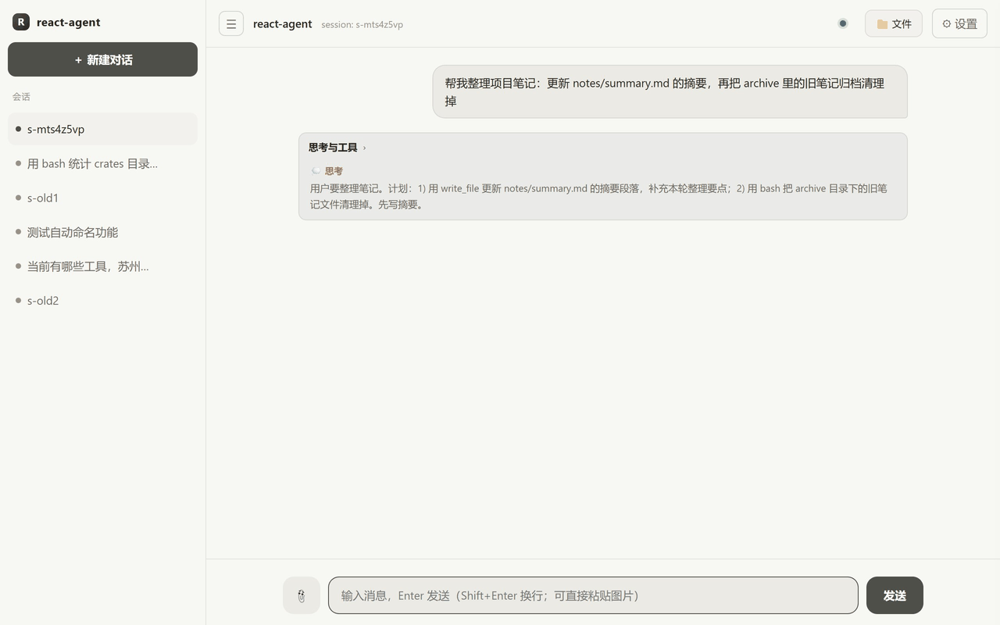

# react-agent

基于 [agent-kernel](https://github.com/zh2673-git/agent-kernel)（v0.1.1，git 依赖）构建的下游 agent 项目：**Rust InProcess 编排 + Python/TS 跨语言插件（gRPC Process 域）** 的 ReAct 式 agent。

```
宿主(装配内核+前端) ──dispatch──> agent-loop(Rust, InProcess)
                                      │ call_plugin（按 Envelope.target 路由，跨域）
        ┌──────────────────┬──────────┼──────────────────┐
        ▼                  ▼          ▼                  ▼
  llm-adapter(Python)   tools(Python) assets(Python)   memory(TypeScript)
  provider pack 注册表   生产级 9 工具  skills/prompts   会话消息+事件日志
  (openai/anthropic/    +越界拦截     注册表(渐进披露)  (JSON/JSONL)
   ollama/mock)         +免费搜索链
```

- 内核只做：插件装载隔离、执行编排、契约/权限校验；一切能力皆为插件
- ReAct 循环：感知(读记忆)→规划(LLM+工具清单)→行动(执行工具/保留名路由)→观察(写回记忆)→收敛；全程发射事件（trace）+ 逐轮进度回显
- 三家 LLM 全覆盖：OpenAI 兼容（可换 base_url 适配 DeepSeek 等）、Anthropic、Ollama；另带 **mock** provider 供离线测试
- 生产级工具 9 件：read_file / write_file / edit_file / list_dir / grep / bash / web_search / web_read / symbols_search（全部免费默认无 key）；另有 **MCP 外接池**（stdio 服务器，`mcp__{server}__{tool}` 命名空间，见 env 表 `MCP_SERVERS` 与 §八）与技能配套工具两池，统一白名单启用
- 双前端：REPL（默认）/ Web 网关（HTTP+SSE，Cursor 暖色系事件流式会话）：左侧会话栏（自动命名 + 持久化）、「思考与工具」过程框（思考链 + 工具卡内联 diff，可折叠回看）、每轮「📝 文件变更」chip（Monaco 双栏 diff 对比变更前后 + 回滚撤销）、🔗 来源溯源抽屉、产物文件卡片 + 📁 工作区文件树、📎 附件上传、消息回滚/重新生成（文件改动随回滚一并撤销）、subagent 实时框、富 markdown；刷新恢复 = 日志重放
- **多窗口多实例**（W17）：启动缺省即 8710 主窗口（自动恢复上次工作区）；侧栏「▣ 新窗口」→「📂 浏览文件夹…」弹原生选择框选任意文件夹即开独立窗口（**实例名自动取文件夹名**，host spawn 自身：独立会话/回滚/配置/端口，并行互不感知；同一文件夹已开着就直接复用该窗口）；**任意窗口都可再开新窗口**（实例平等），首次建窗自动继承模型配置；也可命令行 `start-window.cmd <工作区路径>`
- **Web 配置中心**（08）：右上角 ⚙ 侧边抽屉四标签——LLM（provider/model/站点预设/key，ollama 显原生窗口，热生效 + 落盘 config.json）、工具（内置/技能/MCP 三池分组折叠）、技能（SKILL.md 在线编辑 + 配套工具启停，出厂件删除保护）、Agent（max_rounds/系统提示词/上下文窗口热通道）；配置源文件一键「在编辑器中打开」
- **自扩展**（08）：L1 技能自扩展（skills 根在工作区内时授权模型 write_file 自建技能，文件即注册表，下轮对话可见）；L2 工具自扩展（`tools.reload` 装载 + 配置中心启用，两步分离）；R9 技能自造闭环（`skill_install` 编排 + 语言无关配套工具，前端内联卡一键启用；装载≠启用≠可见）。**已实证**：`gongwen-format` 公文写作技能即 agent 对话中自建（SKILL.md 与配套工具均模型一次生成，跨会话可用，非人工预置）
- subagent：保留工具 `task` 委派子任务（新 session 复用全链路，深度防嵌套）；过程框内嵌「子代理」实时框，子代理思考流与工具卡实时透传（trace 镜像 + 子旁路流式）

## 界面一览


> 实机动图轮播（`REACT_FRONTEND=web` 默认形态）：会话流（左侧会话栏自动命名 + 持久化，刷新即恢复）→
> 「思考与工具」过程框展开（💭 思考链 + 工具卡状态点，可折叠回看）→ 🔗 来源 chip 溯源抽屉 →
> ⚙ 设置面板：LLM（模型/站点/key）· 工具 · 技能（自建技能 gongwen-format 及配套工具启停区）· Agent（max_rounds/上下文窗口热通道）。
> 图中会话即 agent 实际运行记录——工具清单查询 + 联网查天气 + 自动落盘会话命名。



> **执行可见性实机演示**：write_file 写入与 bash 脚本删除 → 每轮答案下方「📝 文件变更 (2)」chip →
> 抽屉列表（「写入」/「脚本」徽章 + round 标注）→ ⇄ Monaco 双栏全文 diff（变更前后对比；
> 删除型显示删除前完整内容并注明回滚可还原）——bash 间接改动与 write/edit 同一追溯链路（W15+W16），
> 回滚时所有变更可一并撤销。

## 目录

```
crates/agent-loop        ReAct 编排插件（InProcess，仅依赖 agent-kernel-sdk）
crates/host              宿主二进制：装配、spawn、探测、双前端（frontend repl + web/ 网关）、sandbox-run 助手；web-dist/ 为 web 前端 index.html+style.css + vendor/（monaco 本地资源 + app.js 拆分出的五模块 app-{core,stream,files,settings,events}.js，运行时 serve，非内嵌）
plugins/llm_adapter      LLM 适配器（Python guest，providers/ 按 vendor 分 pack）
plugins/tools            工具注册与执行（Python guest，纯 stdlib，files/bash/web/grep 分文件）
plugins/assets           skills/prompts 注册表（Python guest，开放标准 SKILL.md）
plugins/memory           会话记忆 + 事件日志（TS guest，strip-types）
docs/                    方案与设计文档（01 总纲 / 02 架构 / 03 模块设计 / 04-07 分模块四层设计 / 08 web 配置中心与自扩展）
```

> **关于 web-dist/vendor（≈11MB）**：Monaco Editor 本地静态资源随源码库分发（不入 npm/CDN 链路），
> 目的是产物卡预览的「本地 vendor → CDN → 纯文本」三级降级在离线/CDN 不可达环境下仍有完整编辑器体验。
> 代价是 clone 体积 +11MB；资源为第三方构建产物，不随业务改动演进。Monaco Editor 采用 MIT 许可
> （版权声明见 `web-dist/vendor/LICENSE-Monaco.txt`），随库分发合规。

## 环境准备（一次）

> Windows 下用 [start.cmd](start.cmd) 一键启动可跳过本节——脚本会自动检测并安装缺失依赖。

```bash
pip install grpcio httpx                                  # python guest 需要
cd ../agent-kernel/bindings/typescript && npm install     # TS guest 从内核仓解析 @grpc 依赖
```

- 前置：Rust、Python 3、Node ≥ 22.6（`--experimental-strip-types`）
- 内核 checkout 默认取本目录旁的 `../agent-kernel`，可用 `AGENT_KERNEL_REPO` 覆盖
- 本地开发内核：取消 `Cargo.toml` 里 `[patch]` 段注释

## 运行

> ⚠️ 默认 `cargo run -p react-agent-host`（不带参数）进入 **REPL 终端交互**，**不会开网页**。
> 要开 Web 页面，必须显式启用 web 前端（见下 `REACT_FRONTEND=web`），或直接双击 `start.cmd`。

```bash
# ── Web 前端（推荐，浏览器开 http://127.0.0.1:8710）──
# Windows 一键（自动补依赖 + 自动开浏览器）：
start.cmd
# PowerShell（bash 的 VAR=val 前缀在 pwsh 不生效，改用 $env:）：
$env:REACT_FRONTEND="web"; cargo run -p react-agent-host
# bash / Linux / macOS：
REACT_FRONTEND=web cargo run -p react-agent-host
# 前端为 web-dist/index.html（运行时读取），改样式刷新即生效（Ctrl+Shift+R 防缓存）

# ── REPL 终端（默认，无网页）──
cargo run -p react-agent-host                          # 进 REPL
cargo run -p react-agent-host -- "用 bash 算一下 128*64"   # 单轮（离线 mock）后退出

# Ollama（本机，推荐支持工具调用的模型如 qwen2.5 / llama3.1+）
LLM_PROVIDER=ollama LLM_MODEL=qwen2.5:7b cargo run -p react-agent-host -- "..."

# OpenAI 兼容（OpenAI/DeepSeek 等）
LLM_PROVIDER=openai LLM_BASE_URL=https://api.deepseek.com/v1 \
OPENAI_API_KEY=sk-xxx LLM_MODEL=deepseek-chat cargo run -p react-agent-host -- "..."

# Anthropic
LLM_PROVIDER=anthropic ANTHROPIC_API_KEY=sk-ant-xxx cargo run -p react-agent-host -- "..."
```

## 前端开发（无构建）

Web 前端是 `crates/host/web-dist/`（index.html + style.css，原生 JS 无框架、无构建步骤；脚本为 `vendor/` 下五模块 `app-{core,stream,files,settings,events}.js`，经 defer 按文档序加载共享全局作用域），由后端 `GET /` 运行时读取 serve。

- **默认（推荐）**：`cargo run -p react-agent-host`（或 `start.cmd`）起 8710，浏览器开 `http://127.0.0.1:8710` 即同时拿到前端与 `/api`。改 `web-dist/` 任一文件后**刷新浏览器即生效**（无需重编 host；若页面不更新按 `Ctrl+Shift+R` 硬刷规避缓存）。
- **多窗口**：Web 侧栏「▣ 新窗口」按钮（📂 弹原生文件夹选择框 → 创建并打开，实例名自动取文件夹名，无需手填路径/起名）；或命令行 `start-window.cmd <工作区路径>`。重启主实例后，未手工停止的子窗口**自动复活**（换新端口，会话/配置保留；探活按实例身份识别，端口被复用不误判）。API 直呼见 [host README「多实例」](crates/host/README.md)。
- **前后端分离（独立端口，HMR）**：后端 `cargo run -p react-agent-host`（8710 作 API 源），前端用 `vite` 起在 `crates/host/web-dist/`（已内置 `vite.config.js`，`/api` 自动反代回 8710）：
  ```bash
  cd crates/host/web-dist && npm install && npm run dev   # 默认 http://localhost:5173
  ```
  浏览器开 5173 即前端（热重载），`/api/*` 经代理转发到 8710，无需跨域配置。仅改样式也可直接编辑 `web-dist/` 文件后刷新，不必起 vite。
  > 没有构建/HMR 需求时不必分离：改完刷新即生效，「一体启动」已是最简工作流。

## 环境变量

| 变量 | 默认 | 说明 |
|---|---|---|
| `LLM_PROVIDER` | `mock` | mock / openai / anthropic / ollama（也可按请求覆盖） |
| `LLM_MODEL` | 按 provider | 模型名 |
| `LLM_BASE_URL` | `https://api.openai.com/v1` | openai 兼容端点 |
| `OLLAMA_HOST` | `localhost:11434` | ollama 地址（Web 设置面板「ollama 地址」栏可改，默认即此值；ollama 免 key，api_key 无效） |
| `OLLAMA_ENDPOINT` | `native` | ollama 传输通道：native（原生 `/api/chat`，per-request `options.num_ctx` + NDJSON 流式）/ v1（回退 OpenAI 兼容层 `/v1`） |
| `OPENAI_API_KEY` / `ANTHROPIC_API_KEY` | — | 密钥（经子进程 env 传递，不落 manifest） |
| `ANTHROPIC_BASE_URL` | `https://api.anthropic.com` | Anthropic 端点 |
| `MOCK_SCRIPT` | — | mock provider 脚本（JSON 数组，逐次弹出） |
| `MAX_ROUNDS` | `8` | ReAct 最大轮数 |
| `AGENT_OUTPUT_DIR` | `outputs` | 产物输出目录（工作区内相对路径）：系统提示词注入产物统一写入约定，前端文件卡片经 `GET /files/{path}` 预览/下载 |
| `LLM_EXTRA_BODY` | — | openai 兼容族请求体逃生舱（JSON 整体合并，如 `{"enable_thinking":true}`）；非法 JSON 打警告忽略 |
| `LLM_DEBUG` | — | 置 `1` 时把 openai 兼容族最终请求体落盘 `.stream/last-request.json`（诊断请求差异） |
| `SESSION_ID` | `default` | REPL/单轮会话 id |
| `AGENT_KERNEL_REPO` | `../agent-kernel` | 内核 checkout（PYTHONPATH/TS shim 解析） |
| `PLUGINS_DIR` | `<workspace>/plugins` | guest 脚本目录 |
| `MEMORY_DATA_DIR` | `plugins/memory/data` | memory 会话与事件日志持久化目录 |
| `WORKSPACE_ROOT` | 进程 cwd | 文件工具越界拦截根（realpath 前缀校验） |
| `TOOLS_ENABLED` | 全开 | 逗号分隔白名单，如 `read_file,write_file,bash`（R9：技能工具名持久化后重启 → 延迟启用，install 时自动生效，不再启动失败） |
| `ALLOW_CORE_WRITE` | `0`（拒绝） | **核心写保护逃生舱**（v6 自扩展安全边界）：`write_file`/`edit_file` 默认拒绝触碰 agent 自身运行体（`crates/`、`plugins/memory`、`plugins/llm_adapter`、`plugins/assets`（skills 根内豁免）、`plugins/tools/tools/`、`plugins/tools/tools_plugin.py`、`config.json`、`.git/`，报 `CORE_PROTECTED`）；自扩展合法途径 = skills 目录 SKILL.md / 技能 tools.json / `plugins/tools/` 顶层新 .py / config.json `mcp_servers`。置 `1` 放行（config.json `tools.allow_core_write: true` 持久通道，改后重启 host）。诚实边界：bash 间接写不经此闸，但 W16 起**自动快照留痕**（含核心区路径），随回滚一并撤销（SYSTEM.md 纪律 + bash 沙箱兜底 + 留痕） |
| `BASH_WRITE_TRACE` | `on` | **W16 bash 文件追溯**：on=每次 bash 执行前后对快照区（工作区 − 噪音目录/`.stream`/产物目录/`MEMORY_DATA_DIR`/`.git`）比对，变更（新增/修改/删除）写 undo 快照并随结果返回 `changes[]` → agent-loop 转发为 op=bash 的 `file_change` 事件，与 write/edit 同一 diff/回滚链路；off=关闭快照。快照区 pre-copy 上限 32MB/4000 文件（超限退化为 stat 比对、变更无 undo 引用）；工作区外改动不追踪；同 mtime+size 的内容替换不检测 |
| `SKILL_TOOL_TIMEOUT_SECS` | `60` | R9 技能工具子进程执行超时（超时杀进程，字段级错误） |
| `MCP_SERVERS` | — | §八 MCP server 声明（整体 JSON：`{"名称":{"command":[...],"args"?,"env"?}}`），host 自 config.json `mcp_servers` 透传；改后需重启 host |
| `SEARCH_REGION` | `cn` | cn（Bing→搜狗→百度零 key 直连）/ global（ddgs→DDG→Bing） |
| `SEARCH_BACKEND` | 自动 | 强制指定引擎：bing / sogou / baidu / ddgs / duckduckgo / bocha / baidu_ai / tavily |
| `BOCHA_API_KEY` / `BAIDU_API_KEY` / `TAVILY_API_KEY` | — | 可选升级搜索后端 |
| `SKILLS_DIR` / `PROMPTS_DIR` | `<workspace>/plugins/assets/{skills,prompts}` | 资产目录 |
| `AGENT_SYSTEM_PROMPT` / `SYSTEM.md` / `PROMPT` | 内置缺省 | 提示词覆盖优先级：env > SYSTEM.md > 具名模板 > 内置 |
| `HISTORY_LIMIT` | 不限 | 每轮回传历史条数上限 |
| `COMPACT_TRIGGER` / `COMPACT_KEEP` | `40` / `10` | 上下文压缩触发阈值（0=禁用）/ 保留最近条数 |
| `LLM_CONTEXT_TOKENS` | `0`（禁用） | 模型上下文窗口（token）：压缩 token 闸 + 发送前逐级收紧（超限收敛为 CONTEXT_OVERFLOW）；并随 `llm.chat` 透传 `num_ctx`（ollama native 映射 `options.num_ctx`，两侧窗口对齐），见 agent-loop README「上下文体积管理」。**L7：仅本地窗口型 provider 生效**（`LOCAL_WINDOW_PROVIDERS` 名单：ollama，新本地后端加名扩展；云端 API 窗口由服务端管理——本闸禁用、`num_ctx` 不下发，为本地调小的窗口值不影响云端历史压缩） |
| `BASH_SANDBOX` | `on` | on=sandbox-run 受限令牌沙箱（探测失败 fail-closed 移除 bash）；off=显式豁免直跑 |
| `REACT_FRONTEND` | `repl` | 前端选择：repl / web |
| `WEB_ADDR` | `127.0.0.1:8710` | web 网关监听地址 |
| `REACT_INSTANCE_NAME` | 空（主实例） | W17 多窗口：实例名（由 `/api/instances` 或 `start-window.cmd` 自动设置/派生，手工启动无需关心）；子实例头部显示徽章，数据存于代码根 `.instances/{name}/`；主实例启动自动恢复 `.instances/.last-workspace` 记忆的工作区，并自动复活未手工停止（无 `stopped` 标记）的已死注册实例（仅 web 交互模式触发） |
| `CONFIG_FILE` | `<workspace>/config.json` | 配置中心持久化文件（启动时应用为 env，Web 保存后落盘） |
| `RUST_LOG` | `warn,react_agent_host=info` | 日志 |

## 测试

```bash
cargo test -p react-agent-agent-loop   # 纯 Rust mock 测试（无需 python/node）
cargo test --workspace                 # 全量（含跨语言 e2e，缺解释器自动 skip）
```

e2e：tools(9 工具往返 + MCP echo 三模式)、memory(append/get/clear/summarize)、llm(mock 脚本)、**全链路 ReAct**、上下文压缩、web 网关（chat+SSE 重放 + **配置中心与技能 CRUD**）、subagent（委派+嵌套拒绝+**事件镜像透传**）、SYSTEM.md 覆盖链与预置技能注册。

> 注意：若测试失败提前退出，guest 子进程可能残留（占用内存无害）；可用 `Get-Process python,node` 检查清理。测试内已将 guest stderr 指向 null，cargo 不会再被泄漏进程扣住。

## Wire 契约（最小契约）

跨插件 payload 均为 JSON；业务错误走 payload 内 `{"ok":false,"error":{...}}`（`code` / `message` / `field` 字段级定位），`KernelError` 仅承载传输/生命周期失败。路由按 `Envelope.target`，op 分派在 payload 的 `"op"` 字段。各 capability 的**完整 op 清单与字段语义**见各模块 README：

| capability | 提供者 | 职责摘要 | 契约详表 |
|---|---|---|---|
| `agent.chat` | agent-loop（InProcess） | ReAct 编排主入口：req `{session_id, user_text, attachments?}` → resp `{answer, rounds, steps}`；保留名 `load_skill`（→assets）/ `skill_install`（R9 编排）/ `task`（子代理）由其内部路由 | [agent-loop README](crates/agent-loop/README.md) |
| `llm.chat` | llm-adapter | 三家 LLM 统一收口：`{messages, tools?, stream_path?, sid?, num_ctx?}`；扩展 `configure` / `abort` / `models.list` / `presets.list` | [llm_adapter README](plugins/llm_adapter/README.md) |
| `tools.exec` | tools | 内置 9 件 + 技能工具 + MCP 第三池：`list` / `call` / `configure` / `reload` / `install` / `skill_tools` / `mcp_tools`（装载≠启用） | [tools README](plugins/tools/README.md) |
| `assets.registry` | assets | skills / prompts 渐进披露注册表（每次重扫，`origin` 来源标记，`tools_manifest` 定点装载指引） | [assets README](plugins/assets/README.md) |
| `memory.session` / `session.trace` | memory | 模型上下文（可压缩可回滚）+ 只追加事件日志（UI 唯一持久事件源） | [memory README](plugins/memory/README.md) |
| `/api/*` + SSE | host（非插件） | Web 网关：会话 / 配置 / 技能 CRUD / 文件通道（含 W14 文件树、W15 变更快照）/ 取消 / 回滚 | [host README「/api/* 一览」](crates/host/README.md) |

## 配置中心与自扩展（08）

- **配置中心**：Web 设置面板保存 → llm-adapter/tools configure op 热生效（env）→ merge 落 `config.json`；重启时还原。env 仍是一切配置之源（spawn 复用既有机制）。
- **L1 技能自扩展**：skills 根落在 `WORKSPACE_ROOT` 内时系统提示词注入授权段——模型用 `write_file` 写 SKILL.md 即完成注册（文件即注册表，下轮对话可见）；硬边界仍是文件工具 realpath 越界拦截。
- **L2 工具自扩展**：符合 ToolSpec 的 `TOOLS` dict 放进 `plugins/tools/` 新 .py → `tools.reload` 装载进池 → 配置中心勾选启用（装载≠启用，两步分离）。
- **R9 技能自造闭环**：模型调 `skill_install` 完成技能包安装编排（SKILL.md + tools.json + 任意语言执行体，子进程 stdin/stdout JSON 协议）；**三层作用域**：装载（进池不可调用）≠ 启用（过配置闸，全局持久）≠ 可见（`load_skill` 后进本会话工具清单）。内置 9 件冻结不扩展。
- 细节见 [agent-loop README「技能自扩展」](crates/agent-loop/README.md) 与 [tools README](plugins/tools/README.md)。

## 架构要点（内核约束的落点）

- **agent-loop 必须在 InProcess 域**：Process guest 无 guest→host 回调，跨插件调用只有进程内 `HostApi::call_plugin` 可用（可跨域调 Process 插件）
- **注册顺序**：memory → llm-adapter → tools → assets → agent-loop（编排依赖序）。装配**并行化**：四 guest 插件 spawn 与探测并发执行（互不依赖），总启动时长 = 最慢单项（如 llm 云端 ping 慢不再拖累其余探测）；probe 带超时护栏（30s，llm 120s）防挂死。内核 `register` 对「硬依赖无 provider」静默失败（K302），故 host 对每个 provider 先探测再注册编排插件。探测失败策略分层：memory/tools 硬依赖失败即退出；llm-adapter **进程存活即依赖就位**，云端 ping 不通仅 warn 降级（chat 时自然报错，web 设置可重配）；assets 本为软依赖
- **guest api_version 必须 (0,1)**：gRPC 握手要求 guest major==host major 且 guest minor ≥ host minor
- **配置走环境变量**：内核 Init 不传业务配置，子进程继承宿主 env
- **循环无跨调用可变态**：ReAct 状态在局部变量 + memory 插件，插件本体 `&self`（A1）；每步转发带 deadline（A2）
- Rust 插件仅依赖 `agent-kernel-sdk`；仅 host 依赖 kernel（process feature）+ process —— 规则防穿透

## 可靠性与执行可见性（现状摘要）

- **运行中断（停止）**：`POST /api/chat/cancel` 双通道——agent-loop `cancel`（工具波次间 + 轮次边界 K499 收敛）+ llm-adapter `abort`（流式逐帧命中即关流，单轮长生成即时中断）。正在执行中的单个工具调用不可中断。机制详见 [agent-loop README](crates/agent-loop/README.md) 与 [llm_adapter README](plugins/llm_adapter/README.md)。
- **sid 唯一性**：sid 形如 `{session}-r{N}`（per session 单调序号，unix 毫秒种子），跨回合不碰撞；改 sid 格式前必查 llm-adapter `_SID_RE` 消费点。见 [agent-loop README「流式编排」](crates/agent-loop/README.md)。
- **执行可见性（V1+V2+W15+W16）**：四层数据源——工具卡内联 diff（tool_call args）→ `file_change` 事件（write/edit/bash 落 trace）→ 变更快照（原始字节落 undo 目录，Monaco 双栏全文 diff）→ 回滚撤销（created 删除 / deleted 还原 / 冲突跳过报告）。bash 间接改文件经快照区比对同样入链（`BASH_WRITE_TRACE=off` 关闭）。机制详见 [agent-loop README「执行可见性」](crates/agent-loop/README.md)。
- **SSE 数据流**：重放/实时分阶段、断线增量续传、doneSids 去重、心跳 5s——完整设计见 [host README「数据流设计要点」](crates/host/README.md)。

## Roadmap（后续方向）

- **R9 增强**：会话级临时启用的授权策略、命令工具执行沙箱化（复用 BASH_SANDBOX 受限令牌思路）、技能来源审计
- **产物卡在线编辑**：Monaco 从只读预览升级为 edit→save（写回需过文件工具同一越界闸与核心写保护）
